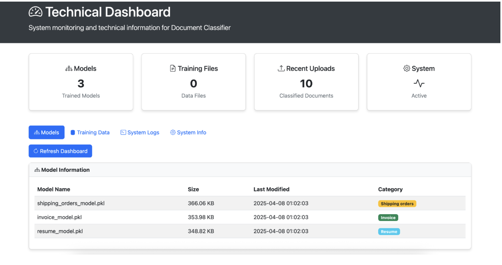
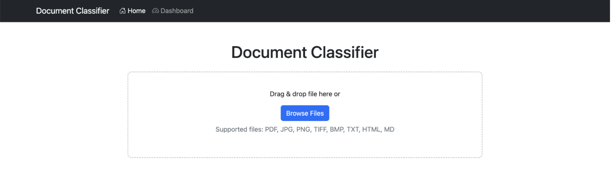

# Document Classification and Information Extraction 

Our repository focuses on classifying 3 different types of documents: Invoices, Resumes and Shipping Orders, any other document will be classified as others. Our models use a combination of AI, natural language processing and computer vision to successfully classify the model into the correct category and extract the necessary information from the documents classified as Invoices.

# Model Pipeline
## Data Collection
- Our entire dataset can be found in the folder `/data` and consists of:
  - [Invoices](https://www.kaggle.com/datasets/ayoubcherguelaine/company-documents-dataset?resource=download)
  - [Shipping orders](https://www.kaggle.com/datasets/ayoubcherguelaine/company-documents-dataset?resource=download)
  - [Resume](https://www.kaggle.com/datasets/ayoubcherguelaine/company-documents-dataset?resource=download)

- The model will be trained to classify the inputted document into these three categories.  
  If it does not align with any of the three, it will be classified as **Others**.

- The data was collected using **Kaggle**, which provided us with a combination of images (`.png`), PDFs, and other document formats. This helped us train the model more effectively.

## 📄 Text Extraction
- Identify whether the model is a .pdf, .png, .txt or any other type of file so that the correct process is used for feature extraction, model training and document classification is used
    - To extract information from a PDF file, the PyPDF2 library is used
    - To extract information from an image, pytesseract’s OCR and OpenCV libraries were used

## 🧪 Feature Extraction
- Performing data preprocessing to prepare the documents for classification and information extraction
- Tokenization, stop word removal, converting to lowercase and TF-IDF vectorization were performed on the information in the documents for easier classification and extraction 

## 📈 Classification and Modelling 
- Implemented a Random Forest Classifier to determine the type of document based on keyword indicators 
- Each model is trained and produces a probability score, which reflects the likelihood of the document belonging to one of the the 4 categories 
- Rule-based classification was used to determine the document type by using keyword indicators to identify the proper classification of the document 
- If a model has a high score but not a single indicator, then it will be given a lower score because it does not have any keywords, for example if an invoice document does not have the word invoice, otherwise the score will improve and the probability of it being classified to the correct category increases.
- The final check is checking the name of the file itself, to see if it contains any of the keywords, and this will consequently boost the score.
- The output loads a pre-trained model from .plk file in the specified directory 
- The classification results will then be stored in a JSON file with all the metadata related to the document

## 🧠 Information Extraction

- Regex was used to extract information from documents classified as invoices.
- The fields our model can extract are:

  - `invoice_number`
  - `invoice_date`
  - `due_date`
  - `issuer_name`
  - `recipient_name`
  - `total_amount`
  - `subtotal`
  - `tax`
  - `payment_terms`
  - `email`
  - `phone_number`

- Utilized `dateutil` to normalize date formats to `YYYY-MM-DD`.
- Identifies and ranks currency values (e.g., total vs. subtotal).
- Detects names from structured headers such as **"Account Name"**.
- Uses context-aware logic and capitalization patterns to improve name/entity detection.
- Final extracted data is output as a structured `.json` file.

## User Interface
- The /templates directory consists of the files for building the UI for uploading the documents to accurately classify them and then extract information from invoice documents.

